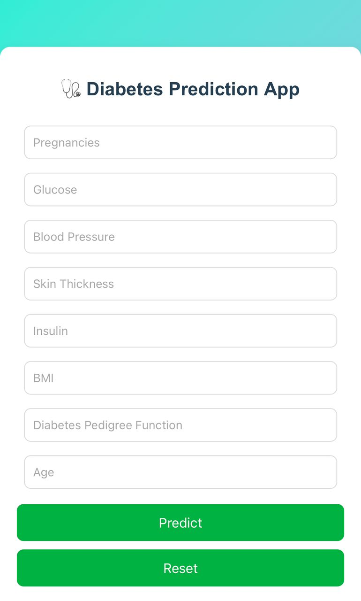
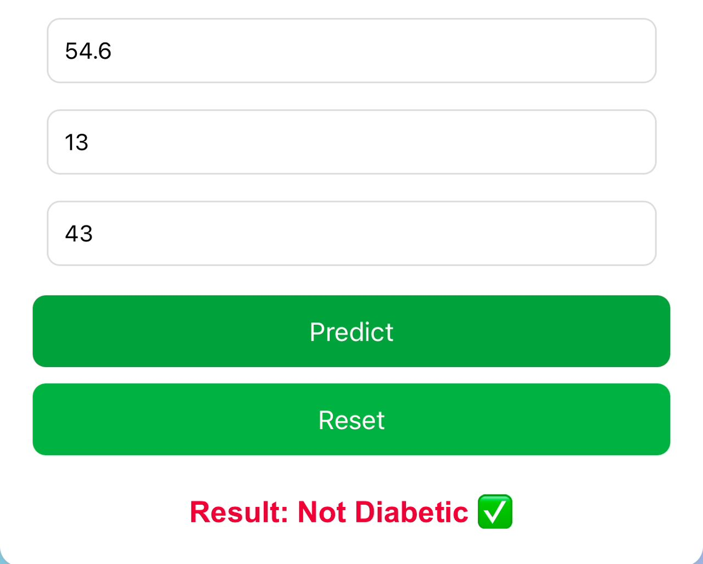

# 🩺 Diabetes Prediction Web App

A machine learning-powered web application that predicts whether a person is *Diabetic* or *Not Diabetic* based on key health parameters.  
Built with *Flask, **scikit-learn, and a clean, responsive **HTML/CSS/JavaScript* frontend — this project demonstrates the full end-to-end ML pipeline: data preprocessing, model training, deployment, and user interaction.

🌐 *Live Demo:* [Try it here](https://diabetes-prediction-webapp-z4u7.onrender.com)

---

## 🚀 Overview

This project is designed to showcase how machine learning can assist in healthcare decision-making. Users input basic health metrics (such as glucose levels, BMI, insulin levels, etc.), and the system predicts the risk of diabetes in real time.

It is an *end-to-end ML web app*:
- ✅ Data preprocessing and feature scaling
- ✅ Model training and serialization
- ✅ Flask backend API
- ✅ Frontend for user interaction
- ✅ JSON-based prediction responses
- ✅ Deployed online for real-world access

---

## 📸 Screenshots

### 🏠 Homepage


### 🧠 Prediction Result


---

## 🧠 Features

- 🧬 *Machine Learning Model*: Built using scikit-learn and trained on the PIMA Diabetes Dataset.
- 🔍 *Feature Scaling*: Preprocessed inputs for improved accuracy.
- 🧑‍⚕ *Interactive Frontend*: Clean and responsive HTML/CSS/JS interface for easy data input.
- ⚡ *Fast Inference API*: Flask backend returns predictions in milliseconds.
- ☁ *Deployment-Ready*: Deployed on [Render](https://render.com) with a simple Procfile.

---

## 🛠 Tech Stack

| Layer             | Technologies Used                                   |
|------------------|------------------------------------------------------|
| *Frontend*     | HTML5, CSS3, Bootstrap, JavaScript                  |
| *Backend*      | Python, Flask                                       |
| *ML / Data*    | scikit-learn, pandas, numpy, joblib                 |
| *Deployment*   | Render, Gunicorn                                    |

---

## 📂 Project Structure
diabetes-prediction-webapp/
├─ app.py # Flask backend and API logic
├─ requirements.txt # Python dependencies
├─ scaler.pkl # Feature scaler for preprocessing
├─ diabetes_model.pkl # Serialized trained model
├─ templates/
│ └─ index.html # Frontend page
├─ static/
│ ├─ css/
│ │ └─ style.css # Styling
│ └─ js/
│ └─ script.js # Frontend interactivity
└─ Procfile # Deployment config for Render 

---

## 📊 How It Works

1. *User Inputs:* Health metrics such as:
   - Glucose
   - BMI
   - Insulin level
   - Blood pressure
   - Age, etc.

2. *Backend Processing:*
   - Inputs are preprocessed and scaled using StandardScaler.
   - The trained ML model (RandomForestClassifier) predicts the outcome.

3. *Prediction:*
   - ✅ “Diabetic 🩺” — if the model predicts 1  
   - ✅ “Not Diabetic ✅” — if the model predicts 0

4. *Response:* JSON is sent back to the frontend and displayed instantly.

---

## ⚙ Installation & Local Setup

### 1️⃣ Clone the repository
```bash
git clone https://github.com/Emmanoel24/diabetes-prediction-webapp.git
cd diabetes-prediction-webapp 
```

✨ Author

👤 Moyinoluwa Idowu
📍 Lagos, Nigeria
📧 Moyinoluwa.idowu24@gmail.com